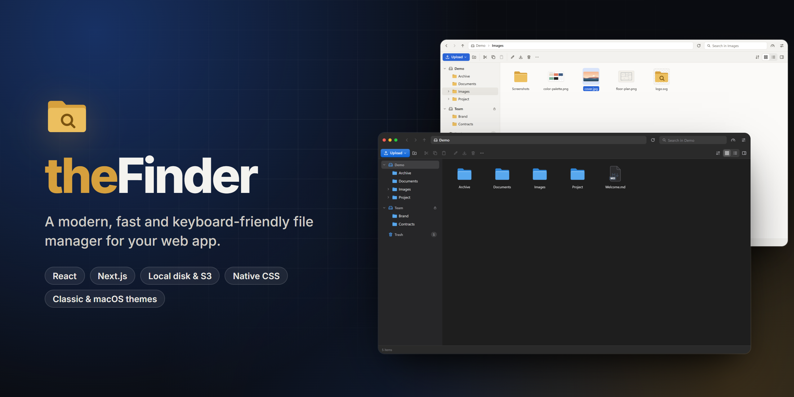
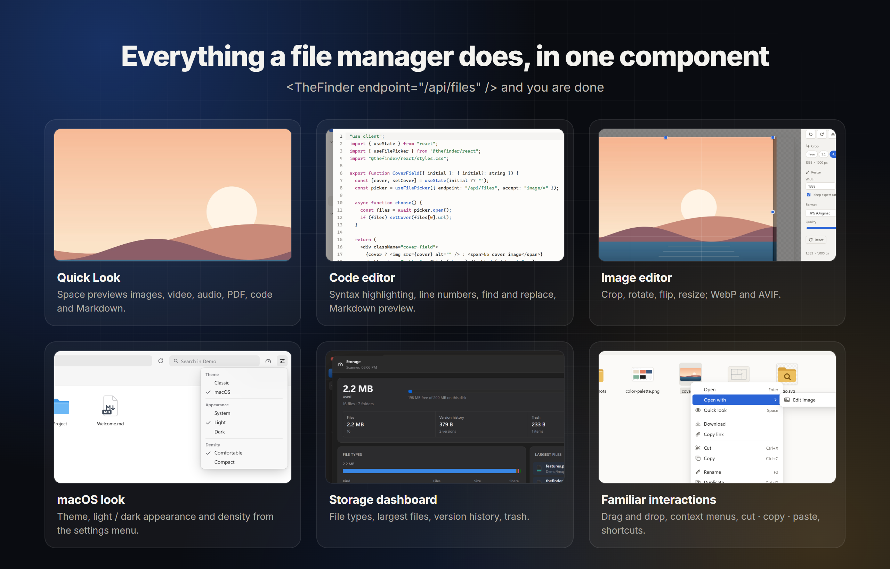

<div align="center">

<a href="https://alperkosay.github.io/thefinder/"></a>

<h1>theFinder</h1>

<p><strong>A Finder for the web.</strong><br />
A fast, keyboard-friendly file manager for React. Plain CSS, a zero-dependency core and a single API endpoint.</p>

<p>
  <a href="https://www.npmjs.com/package/@thefinder/react"></a>
  <a href="https://github.com/alperkosay/thefinder/actions/workflows/ci.yml"></a>
  <a href="LICENSE"></a>
  <a href="packages/core/package.json"></a>
  
  <a href="https://alperkosay.github.io/thefinder/demo/"></a>
</p>

<p>
  
  
  
  
  
  
  
</p>

<p>
  <a href="https://alperkosay.github.io/thefinder/demo/"><b>Live demo</b></a>
  &nbsp;·&nbsp;
  <a href="https://alperkosay.github.io/thefinder/docs/"><b>Documentation</b></a>
  &nbsp;·&nbsp;
  <a href="docs/api/README.md"><b>API reference</b></a>
  &nbsp;·&nbsp;
  <a href="README.tr.md">Türkçe</a>
</p>

</div>



A file manager for React. The UI is written in plain CSS and depends on no UI library. The backend is built on the Web standard `Request → Response`, so it runs on Next.js (standalone included), Node.js, Bun, Express, Fastify, Koa and Hono. Files can live on the local disk, in S3, or in both at once.

| Package | Version | What's inside |
|---|---|---|
| [`@thefinder/core`](packages/core) | [](https://www.npmjs.com/package/@thefinder/core) | Server engine, local and S3 drivers, Node adapters, browser client. No runtime dependencies. |
| [`@thefinder/next`](packages/next) | [](https://www.npmjs.com/package/@thefinder/next) | Next.js routes and standalone-aware project root detection. |
| [`@thefinder/react`](packages/react) | [](https://www.npmjs.com/package/@thefinder/react) | The `<TheFinder />` component, `useFilePicker` / `openFilePicker` and `styles.css`. Its only dependency is `react` (peer). |
| [`@thefinder/ckeditor`](packages/ckeditor) | [](https://www.npmjs.com/package/@thefinder/ckeditor) | CKEditor 5 and CKEditor 4 connector (a drop-in for CKFinder). |

For every option, command and type, see the [API reference](docs/api/README.md). Live demo, docs and a comparison with elFinder: [alperkosay.github.io/thefinder](https://alperkosay.github.io/thefinder/).



## Features

- **Browsing:** Icon and list views, virtualized list (10,000+ files stay smooth), folder tree, editable path bar, history (back/forward).
- **Selection:** Multi-select with Ctrl/Shift, lasso selection by dragging, type-ahead to jump to a file.
- **File operations:** Cut, copy, paste, duplicate, inline rename, delete. On a name conflict you are asked to "replace / keep both / skip".
- **Drag & drop:** Move into folders and onto the sidebar; hold Ctrl or Alt to copy. Files and folders can be dropped from the desktop.
- **Uploads:** Sent in chunks, so large files never hit server body limits. Progress, cancel and retry; folder structure is preserved.
- **Downloads:** A single file downloads directly. Several files or a folder download as a zip built on the fly on the server (zip64 supported).
- **Archives:** Create and extract zips, with zip-slip and zip-bomb protection.
- **Trash:** No database needed. `Delete` moves items to the trash without asking and the toast shows an "Undo" button. `Shift+Delete` deletes permanently. Restore, permanent delete, empty, and automatic cleanup after 30 days.
- **Version history:** No database needed. When a file is overwritten (editor, bulk optimization, upload with "replace") its previous content is kept; versions can be previewed, restored and deleted.
- **Bulk image processing:** Resize, lower quality, convert to WebP / AVIF / JPEG. When the format changes the original stays in place and a new file is created next to it.
- **Storage dashboard:** Opened from the header button. Usage by file type, largest files, versions, trash and cache size; cleanup of versions and cache.
- **File picker:** A "Choose file" button next to any form field with the `useFilePicker` hook; CKEditor 5 / 4 connector.
- **Search:** Also searches subfolders. Case and accent insensitive; Turkish ı/İ match correctly.
- **Thumbnails:** Generated on the server (WebP, 128/256/512 px) and cached. Phone photos are rotated according to their EXIF orientation.
- **Quick look (Space):** Preview images, video, audio, PDF, code and Markdown.
- **Built-in editors:**
  - Code editor: highlighting for 13 language families, find/replace, go to line, smart indentation, save with Ctrl+S.
  - Markdown editor with preview.
  - Image editor: crop, rotate, flip, resize, choose format and quality.
- **Keyboard and accessibility:** Everything can be done with the keyboard. The list view is an ARIA grid and the icon view a listbox. An axe-core scan reports 0 WCAG 2.1 AA violations in both light and dark themes.
- **Touch:** Tap opens, long press selects and opens the menu (iOS included). Taps after a long press add to or remove from the selection. On narrow screens the sidebar becomes a drawer.
- **Appearance:** Light/dark/auto theme, two densities, adapts to narrow containers (container queries).
- **Languages:** English and Turkish built in; add more with the `messages` prop.

## Installation

```bash
npm i @thefinder/core @thefinder/react @thefinder/next
```

## Next.js

**1. Server setup (`lib/finder.ts`)**

```ts
import { createTheFinder, localDriver, uploadsDir } from "@thefinder/next";

export const finder = createTheFinder({
  volumes: [
    {
      id: "uploads",
      name: "Uploads",
      driver: localDriver({ root: uploadsDir() }), // <project root>/uploads
      url: "/uploads",
      denyExtensions: ["php", "exe"],
    },
  ],
  authorize: async ({ request }) => Boolean(await getSession(request)), // optional
});
```

**2. API route (`app/api/files/route.ts`)**

```ts
import { createNextRoutes } from "@thefinder/next";
import { finder } from "@/lib/finder";

export const runtime = "nodejs";
export const { GET, POST } = createNextRoutes(finder);
```

**3. Serving files (`app/uploads/[...path]/route.ts`)**

```ts
import { createUploadsRoute } from "@thefinder/next";

export const runtime = "nodejs";
export const { GET, HEAD } = createUploadsRoute();
```

**4. The page**

```tsx
"use client";
import { TheFinder } from "@thefinder/react";
import "@thefinder/react/styles.css";

export default function Files() {
  return (
    <div style={{ height: "100vh" }}>
      <TheFinder endpoint="/api/files" locale="en" />
    </div>
  );
}
```

### Standalone and the `uploads` folder

- `uploadsDir()` returns the `uploads/` folder in the project root in every mode:
  - `next dev` and `next start`: the working directory.
  - `output: "standalone"`: `server.js` moves itself into `.next/standalone/...`, so the path before `.next` is used. Files are written to the project root, not into the build output.
- With Docker or a persistent disk you can change the folder with environment variables:
  - `CI_FINDER_UPLOADS_DIR=/data/uploads` changes only the uploads folder.
  - `CI_FINDER_ROOT=/app` changes the project root.
- Why not `public/`? In production Next.js does not serve files added to `public/` after the build. `createUploadsRoute` reads files from disk on every request. It supports Range (video seeking), ETag and 304, and serves HTML and SVG files with `CSP: sandbox`.
- A standalone build does not copy `.next/static` by itself. [examples/next/scripts/copy-standalone-assets.mjs](examples/next/scripts/copy-standalone-assets.mjs) does this in a `postbuild` step.
- In a monorepo, add `outputFileTracingRoot` to `next.config`; see [examples/next/next.config.mjs](examples/next/next.config.mjs).
- To keep thumbnails working in standalone, include sharp's native libraries. Next's file tracer does not pick up the `libvips` DLL/`.so` files on its own:
  ```js
  // next.config.mjs
  outputFileTracingIncludes: { "/api/files": ["./node_modules/@img/**/*"] },
  ```
  If you forget this the file manager keeps working: the server logs a warning and sends the original images instead of thumbnails.

### Authorization

theFinder does not manage sessions; you read your app's session (Auth.js, Clerk, your own cookie…) in the `authorize` hook:

```ts
import { TheFinderError } from "@thefinder/next"; // or "@thefinder/core"

createTheFinder({
  volumes,
  authorize: async ({ request, cmd }) => {
    const session = await getSession(request);
    if (!session) throw new TheFinderError("UNAUTHORIZED");          // → 401
    if (session.role === "viewer") return { readOnly: true };       // everything read-only
    return true;                                                     // false → 403
  },
});
```

- Returning `false` gives 403, throwing `UNAUTHORIZED` gives 401.
- Returning `{ readOnly: true }` makes every volume read-only for that request. The UI hides write actions by itself, and the API rejects writes with a `READ_ONLY` error.
- When the UI receives a 401 it calls `onUnauthorized`, for example `<TheFinder onUnauthorized={() => location.assign("/login")} />`.
- To protect `/uploads` as well: `createUploadsRoute({ authorize: (request) => isSignedIn(request) })`.

## Bun

```ts
import { createTheFinder, createFileServer } from "@thefinder/core";
import { localDriver } from "@thefinder/core/local";
import index from "./index.html";

const driver = localDriver({ root: "./uploads" });
const finder = createTheFinder({ volumes: [{ id: "files", driver, url: "/uploads" }] });

Bun.serve({
  routes: {
    "/": index, // Bun bundles the React UI itself
    "/api/files": finder.handler,
    "/uploads/*": createFileServer({ driver, prefix: "/uploads" }),
  },
});
```

## Node.js, Express, Fastify, Koa

```ts
import { toExpress, toNodeHandler, toFastify, toKoa } from "@thefinder/core/node";

app.all("/api/files", toExpress(finder.handler));                       // Express / Connect
http.createServer(toNodeHandler(finder.handler));                       // plain node:http
fastify.register(toFastify(finder.handler), { prefix: "/api/files" });  // Fastify
router.all("/api/files", toKoa(finder.handler));                        // Koa
```

Body parsers such as `express.json()` and `koa-bodyparser` cause no trouble; if the body was already read, the adapter rebuilds it. The adapters are tested against real Express 5, Fastify 5 and Koa 3 servers, covering JSON commands, chunked uploads, Range downloads and zip downloads. In Web-standard runtimes such as Hono, Deno and Cloudflare, use `finder.handler` directly.

## S3, R2, MinIO

```ts
import { s3Driver } from "@thefinder/core/s3";

volumes: [
  { id: "local", driver: localDriver({ root: uploadsDir() }), url: "/uploads" },
  {
    id: "s3",
    name: "Cloud",
    driver: s3Driver({
      bucket: "my-bucket",
      region: "auto",                                   // "auto" for R2
      endpoint: "https://<id>.r2.cloudflarestorage.com", // leave empty for AWS
      accessKeyId: process.env.S3_KEY!,
      secretAccessKey: process.env.S3_SECRET!,
      prefix: "uploads/",
    }),
    url: "https://cdn.example.com/uploads", // if you have a public bucket/CDN; otherwise presigned URLs are used
  },
];
```

- No AWS SDK; signing (SigV4) uses Web Crypto and also works on the Edge runtime.
- Copying and moving between the local disk and S3 is supported.
- Uploads use S3 multipart and the server keeps no state between requests, so it works in serverless environments too. With S3, `chunkSize` must be at least 5 MiB (the default is 5 MiB).
- For the image editor to edit images stored in S3, the bucket needs a CORS rule (`GET`, your app's origin).
- Integration tests against a real S3-compatible server:
  ```bash
  CI_FINDER_S3_ENDPOINT=http://127.0.0.1:7070 CI_FINDER_S3_KEY=... CI_FINDER_S3_SECRET=... npm run test:s3 -w @thefinder/core
  ```
  These tests were run against [Versity Gateway](https://github.com/versity/versitygw) 1.8 and all passed. They cover signature verification, Turkish and special-character keys, multipart uploads, paginated listing of more than 1,000 objects, presigned URLs, trash and thumbnails.

## Thumbnails

```ts
import { sharpThumbnailer } from "@thefinder/core/sharp";

createTheFinder({
  volumes,
  thumbnails: { generator: sharpThumbnailer() }, // sizes: [128, 256, 512], concurrency: 2
});
```

- Generated with [`sharp`](https://sharp.pixelplumbing.com). Next.js projects already ship it (`next/image` uses it); elsewhere `npm i sharp` is enough. The core package itself does not depend on sharp; only the `@thefinder/core/sharp` subpath imports it.
- Generated on first request and stored in the hidden `.tf-thumbs/` folder inside the volume (works on S3 too). Regenerated when the source image changes; cleaned up when the file is deleted, moved or renamed. The folder can be deleted at any time and is rebuilt when needed.
- **Abuse protection:**
  - Only the configured sizes are generated; arbitrary sizes cannot be requested.
  - Concurrent generation is limited, and simultaneous requests for the same image are merged into one.
  - Files larger than 40 MB and images larger than 120 megapixels are not thumbnailed.
- For unsupported or corrupt files the original is sent and the UI keeps working. If sharp cannot be loaded at all (for example the native binaries were not copied to the server), the API keeps working, logs a warning once and shows the original images.
- Thumbnails are served with `?v=<mtime>` URLs, so browsers cache them for a year.

## Trash

No database is used. Each volume keeps its own trash in a hidden `.tf-trash/` folder:

```
uploads/.tf-trash/
  mgh2k1-a8f3c2d1/          ← the deleted item (with its original name)
    Invoices/...
  mgh2k1-a8f3c2d1.json      ← { name, originalPath, deletedAt, kind, size }
```

- Works the same on the local disk and on S3, and survives server restarts.
- A restored item goes back to its old place. If the old folder is gone it is recreated; if another item has the same name, it becomes "file (2)".
- Expired items are cleaned up whenever the trash is listed, so no cron is needed.
- `.tf-trash` never shows up in normal listings, search, zip downloads or the `/uploads` route, even with `showHidden: true`.

```ts
{ id: "uploads", driver, trash: { retentionDays: 14 } } // default: 30 days
{ id: "tmp", driver, trash: false }                      // no trash, delete right away
```

API commands: `rm` (moves to trash by default, `permanent: true` deletes for good), `trash`, `restore`, `purge` (`{ ids }` or `{ all: true }`).

## Version history

Like the trash, no database. Before a file is overwritten, its old content is copied into the hidden `.tf-versions/` folder inside the volume:

```
uploads/.tf-versions/
  3f0a…c9/                         ← sha1(file path)
    file.json                      ← { path }
    mgh2k1-a8f3c2-edit.bin         ← time-random-reason
    mgh3p0-19bd04-optimize.bin
```

- A version is taken when: saving in an editor (code and image), overwriting during bulk optimization, uploading with "replace", pasting with "replace", restoring a version (the state before the restore becomes a version too, so it can be undone).
- On rename and move (folder moves included) the history follows the file. When a file goes to the trash its history stays and reattaches when it is restored; a permanent delete removes the history as well.
- Restoring a version of a file that was deleted outside theFinder recreates the file.
- Taking a version is a copy: a file copy on the local disk, a server-side `CopyObject` on S3 (data never passes through your server). Listing a file's history is a single folder listing.

```ts
{ id: "uploads", driver, versions: { maxPerFile: 20, retentionDays: 0 } } // default; 0 = keep forever
{ id: "tmp", driver, versions: false }
```

In the UI: right click → "Version history", the details panel, and the history button in the image editor. Bulk cleanup lives in the storage dashboard: versions older than X days, last N versions per file, versions of deleted files, all.

API commands: `versions`, `version` (GET, serves the version), `revert`, `rmVersions`, `stats`, `cleanup` (`{ target: "versions", mode: "all" | "orphaned" | "older" | "keep" }` or `{ target: "cache" }`).

## Bulk image processing

```ts
import { sharpImages, sharpThumbnailer } from "@thefinder/core/sharp";

createTheFinder({
  volumes,
  thumbnails: { generator: sharpThumbnailer() },
  images: sharpImages(), // resize, compress, WebP / AVIF / JPEG / PNG
});
```

- Select images, right click → "Optimize images…": preset sizes (3840, 2560, 1920, 1280, 800) or a custom size, format, quality.
- Images are fitted into the box keeping their aspect ratio and are never upscaled. EXIF orientation is applied and metadata is stripped; animated GIF/WebP stay animated if the target format supports it.
- **If the format changes** (e.g. PNG → WebP) the original is kept and `photo.webp` is created next to it. **If the format stays the same** the file is overwritten (its old content goes into version history) or an `-optimized` copy is created.
- With "Skip images that don't get smaller" on, files whose result would be larger than the original are left alone. For PNG, a quality below 100 reduces it to a 256-color palette.
- At most two images are processed at once; inputs larger than 60 MB are rejected (`maxImageSize`).
- Without `images`, the same dialog processes images in the browser (with canvas): PNG, JPEG and WebP.

## File picker: `useFilePicker`

Opens theFinder as a modal picker and resolves a `Promise` with the selected files. Resolves `null` if the user cancels.

```tsx
import { useFilePicker } from "@thefinder/react";

const picker = useFilePicker({ endpoint: "/api/files", accept: "image/*" });

<input value={cover} onChange={(e) => setCover(e.target.value)} />
<button onClick={async () => {
  const files = await picker.open();
  if (files) setCover(files[0].url); // "/uploads/cover.png"
}}>Choose file</button>
```

- `accept`: the same syntax as `<input type="file">` (`"image/*"`, `".pdf,.docx"`) or `(entry) => boolean`. Files that don't match are dimmed and cannot be selected.
- `multiple`, `selectLabel`, `locale`, `theme` and the other `<TheFinder />` props apply. `absoluteUrls: true` returns full URLs.
- Outside React (vanilla JS, Vue…) it's the same: `const files = await openFilePicker({ endpoint: "/api/files" })`.
- Working example: the `/playground` page in `examples/next`.

## CKEditor

`@thefinder/ckeditor` does what CKFinder does: it adds a file manager button to the toolbar and uploads pasted / dropped images through theFinder.

**CKEditor 5**

```ts
import { TheFinder } from "@thefinder/ckeditor";

ClassicEditor.create(el, {
  licenseKey: "GPL",
  plugins: [Essentials, Paragraph, Image, ImageUpload, Link, TheFinder],
  toolbar: ["bold", "link", "|", "theFinder"],
  theFinder: { endpoint: "/api/files", uploadFolder: "/editor" },
});
```

**CKEditor 4**

```ts
import { registerTheFinder } from "@thefinder/ckeditor/v4";

registerTheFinder(window.CKEDITOR);
CKEDITOR.replace("body", {
  extraPlugins: "thefinder,uploadimage",
  theFinder: { endpoint: "/api/files", uploadFolder: "/editor" },
});
```

- Picked images are inserted as images, other files as links (if text is selected, the link goes on it).
- In CKEditor 4 the "Browse Server" buttons of the Image and Link dialogs open theFinder too.
- `uploadFolder` is created when missing; `false` keeps the editor's own upload setup. Use `picker` for picker options (`accept`, `theme`…) and `openPicker` to plug in a picker of your own.
- The last open-source release of CKEditor 4 is 4.22.1; 4.23 and later require a commercial license key. The connector works with both.

## `<TheFinder />` props

| Prop | Description |
|---|---|
| `endpoint` | API URL, e.g. `/api/files` |
| `headers`, `credentials` | Extra request headers (e.g. `Authorization`), cookie mode for cross-origin |
| `locale`, `messages` | `"en"` / `"tr"`, add or override translations |
| `theme` | `"auto"` (default), `"light"`, `"dark"` |
| `skin` | `"classic"` (default), `"macos"` (Finder-like look) |
| `density` | `"comfortable"` (default), `"compact"` |
| `settings` | Settings menu in the header (theme, view, density). The user's choice is stored under `persistKey`. Default `true` |
| `height`, `className`, `style` | Size and style. Default height is 100% of the parent |
| `initialFolder`, `defaultView`, `persistKey` | Start folder, default view and sorting, localStorage key for preferences |
| `rememberFolder` | Reopen the folder the user was last in (default: true) |
| `onSelect`, `selectLabel`, `multiple` | Picker mode (e.g. a "choose image" field in a CMS) |
| `accept`, `onCancel` | Selectable files in picker mode (`"image/*"`, `".pdf"`…) and a "Cancel" button |
| `onOpen` | Intercepts opening a file; return `true` to skip the default behavior |
| `onChange` | Called after every change (upload, delete, move…) |
| `editors` | Adds your own editor to the "Open with" menu |

## Theming

All styles live in `@layer thefinder`, so any rule you write outside the layer wins. Colors are CSS custom properties:

```css
.tf-root {
  --tf-accent: #0f766e;
  --tf-radius: 4px;
  --tf-font: "Inter", system-ui, sans-serif;
}
.tf-root[data-theme="dark"] {
  --tf-bg: #101418;
}
```

## Security

- **Path traversal:** Paths containing `..` are not resolved, they are rejected outright. Symlinks pointing outside the root are hidden.
- **CSRF:** Every mutating request needs the `x-thefinder` header; mutating commands do not run over GET.
- **Authorization:** Per volume `readOnly`, `permission(action, path)`, extension allow and deny lists, `maxUploadSize`; per command the `authorize` hook.
- **Archives:** Zip-slip and zip-bomb protection (`maxExtractSize`).
- **Internal folders:** `.tf-trash`, `.tf-versions` and `.tf-thumbs` cannot be reached by any command, search or the `/uploads` URL, and no folder can be created with those names.
- **Active content:** Uploaded HTML and SVG files are served with a sandbox CSP, so they cannot run scripts on your app's origin.
- **Authentication:** Authentication happens in the `authorize` hook; with default settings anyone can reach the API. See [Authorization](#authorization) for details.

## Development

```bash
npm install
npm run build      # core → next → react → ckeditor
npm test           # core tests (Node)
npm run test:bun   # the same tests on Bun
npm run dev        # builds the packages and starts the Next example (http://localhost:3000)
npm run site:dev   # builds and serves the GitHub Pages site (http://localhost:4173); run npm run build first
```

Examples: [examples/next](examples/next), [examples/bun](examples/bun), [examples/express](examples/express).

The site source lives in [site/](site). The docs pages are generated from `README.md`, `README.tr.md` and `docs/api/**/*.md`; the live demo runs the real `@thefinder/core` engine in the browser with an in-memory driver. Every push to `main` publishes the site through the [Pages](.github/workflows/pages.yml) workflow.

## Versioning and releases

Versions are managed with [Changesets](https://github.com/changesets/changesets). The four packages are always released with the same version number.

1. When you make a change worth releasing, run `npx changeset`. Pick the affected packages and `patch` / `minor` / `major`, and write a short summary. Commit the generated `.changeset/*.md` file together with the change.
2. Every push to `main` runs the [Release](.github/workflows/release.yml) workflow. If there are pending changesets it opens or updates a "chore: version packages" PR that bumps versions and writes the `CHANGELOG.md` files.
3. When that PR is merged the packages are built and published to npm, with provenance.

Requirements:
- The `thefinder` organization on npm (for the `@thefinder/*` scope).
- An `NPM_TOKEN` repository secret: a granular or Automation npm token with publish rights.
- *Settings › Actions › General › Allow GitHub Actions to create and approve pull requests* enabled in the repo settings.

Manual releases work too: `npm run version-packages`, then `npm login` and `npm run release`.

## License

[MIT](LICENSE) © Alper Koşay
