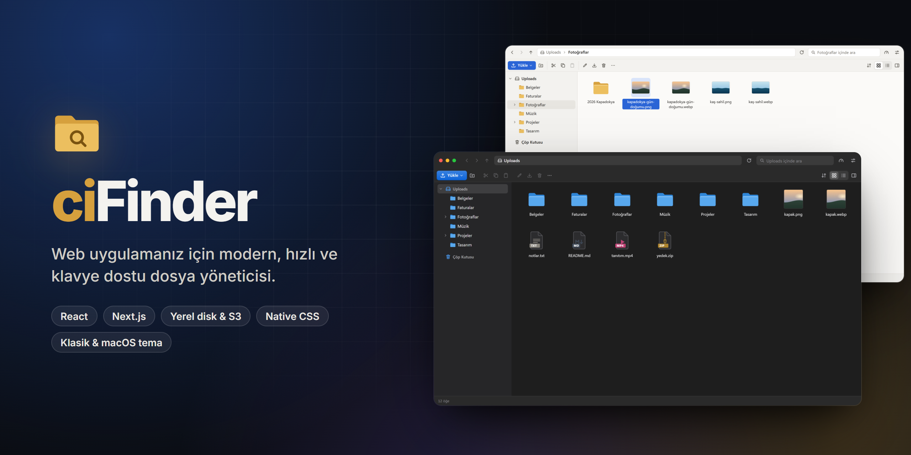
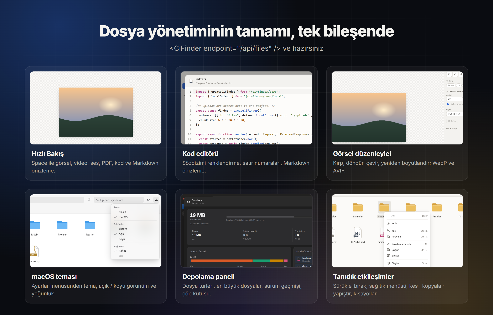

# ciFinder



React için dosya yöneticisi. Arayüz saf CSS ile yazıldı, hiçbir UI kütüphanesine bağlı değil. Backend Web standardı `Request → Response` üzerine kurulu; Next.js (standalone dahil), Node.js, Bun, Express, Fastify, Koa ve Hono ile çalışır. Dosyalar yerel diskte, S3'te ya da ikisinde birden tutulabilir.

| Paket | İçerik |
|---|---|
| `@ci-finder/core` | Sunucu motoru, yerel ve S3 sürücüleri, Node adaptörleri, tarayıcı istemcisi. Çalışma zamanı bağımlılığı yok. |
| `@ci-finder/next` | Next.js route'ları ve standalone uyumlu proje kökü tespiti. |
| `@ci-finder/react` | `<CiFinder />` bileşeni, `useFilePicker` / `openFilePicker` ve `styles.css`. Tek bağımlılığı `react` (peer). |
| `@ci-finder/ckeditor` | CKEditor 5 ve CKEditor 4 connector'ı (CKFinder'ın yerine). |

Tüm seçenekler, komutlar ve tipler için: [API referansı](docs/api/README.md).



## Özellikler

- **Gezinme:** Simge ve liste görünümü, sanal liste (10.000+ dosya akıcı), klasör ağacı, düzenlenebilir yol çubuğu, geçmiş (geri/ileri).
- **Seçim:** Ctrl/Shift ile çoklu seçim, sürükleyerek alan (lasso) seçimi, yazarak dosyaya atlama.
- **Dosya işlemleri:** Kes, kopyala, yapıştır, çoğalt, yerinde yeniden adlandır, sil. Ad çakışmasında "değiştir / ikisini de tut / atla" sorulur.
- **Sürükle-bırak:** İçeride klasörlere ve kenar çubuğuna taşıma; Ctrl veya Alt ile kopyalama. Masaüstünden dosya ve klasör bırakılabilir.
- **Yükleme:** Parça parça (chunk'lı) gönderilir, böylece büyük dosyalar sunucu gövde limitlerine takılmaz. İlerleme, iptal ve tekrar deneme var; klasör yapısı korunur.
- **İndirme:** Tek dosya doğrudan iner. Birden çok dosya ya da klasör, sunucuda anında oluşturulan zip olarak iner (zip64 destekli).
- **Arşiv:** Zip oluşturma ve çıkarma; zip-slip ve zip bombası koruması dahil.
- **Çöp kutusu:** Veritabanı gerektirmez. `Delete` öğeyi onay sormadan çöpe taşır ve bildirimde "Geri al" düğmesi çıkar. `Shift+Delete` kalıcı olarak siler. Geri yükleme, kalıcı silme, boşaltma ve 30 gün sonra otomatik temizlik var.
- **Sürüm geçmişi:** Veritabanı gerektirmez. Bir dosyanın üzerine kaydedildiğinde (editör, toplu optimizasyon, "değiştir" ile yükleme) eski hali saklanır; önizlenebilir, geri yüklenebilir, silinebilir.
- **Toplu görsel işlemleri:** Seçili görselleri yeniden boyutlandırma, kaliteyi düşürme, WebP / AVIF / JPEG'e çevirme. Biçim değişince orijinal yerinde kalır, yanına yeni dosya oluşur.
- **Depolama paneli:** Üst çubuktaki düğmeyle açılır. Dosya türlerine göre kullanım, en büyük dosyalar, sürümler, çöp kutusu ve önbellek boyutu; sürüm ve önbellek temizliği.
- **Dosya seçici:** `useFilePicker` hook'u ile formdaki bir alanın yanına "Dosya seç" düğmesi; CKEditor 5 / 4 connector'ı.
- **Arama:** Alt klasörlerde de arar. Büyük/küçük harf ve aksan duyarsızdır; Türkçe ı/İ doğru eşleşir.
- **Küçük resimler:** Sunucuda üretilir (WebP, 128/256/512 px) ve önbellekte tutulur. Telefon fotoğrafları EXIF bilgisine göre doğru yöne çevrilir.
- **Hızlı bakış (Space):** Resim, video, ses, PDF, kod ve Markdown önizlemesi.
- **Dahili editörler:**
  - Kod editörü: 13 dil ailesi için renklendirme, bul/değiştir, satıra git, akıllı girinti, Ctrl+S ile kaydetme.
  - Önizlemeli Markdown editörü.
  - Görsel editörü: kırp, döndür, çevir, boyutlandır, biçim ve kalite seçimi.
- **Klavye ve erişilebilirlik:** Tüm işlemler klavyeyle yapılabilir. Liste görünümü bir ARIA grid'i, simge görünümü bir listbox olarak tanımlı. axe-core taramasında açık ve koyu temada 0 WCAG 2.1 AA ihlali çıktı.
- **Dokunmatik:** Dokunma açar, uzun basma seçip menüyü açar (iOS dahil). Uzun basmadan sonraki dokunmalar seçime ekler veya çıkarır. Dar ekranda kenar çubuğu açılır menü olarak gelir.
- **Görünüm:** Açık/koyu/otomatik tema, iki yoğunluk seçeneği, dar ekranlara uyum (container query).
- **Dil:** Türkçe ve İngilizce hazır; `messages` prop'u ile başka diller eklenebilir.

## Kurulum

```bash
npm i @ci-finder/core @ci-finder/react @ci-finder/next
```

## Next.js

**1. Sunucu ayarı (`lib/finder.ts`)**

```ts
import { createCiFinder, localDriver, uploadsDir } from "@ci-finder/next";

export const finder = createCiFinder({
  volumes: [
    {
      id: "uploads",
      name: "Uploads",
      driver: localDriver({ root: uploadsDir() }), // <proje kökü>/uploads
      url: "/uploads",
      denyExtensions: ["php", "exe"],
    },
  ],
  authorize: async ({ request }) => Boolean(await getSession(request)), // isteğe bağlı
});
```

**2. API route'u (`app/api/files/route.ts`)**

```ts
import { createNextRoutes } from "@ci-finder/next";
import { finder } from "@/lib/finder";

export const runtime = "nodejs";
export const { GET, POST } = createNextRoutes(finder);
```

**3. Dosya sunumu (`app/uploads/[...path]/route.ts`)**

```ts
import { createUploadsRoute } from "@ci-finder/next";

export const runtime = "nodejs";
export const { GET, HEAD } = createUploadsRoute();
```

**4. Sayfa**

```tsx
"use client";
import { CiFinder } from "@ci-finder/react";
import "@ci-finder/react/styles.css";

export default function Files() {
  return (
    <div style={{ height: "100vh" }}>
      <CiFinder endpoint="/api/files" locale="tr" />
    </div>
  );
}
```

### Standalone ve `uploads` klasörü

- `uploadsDir()` her modda proje kökündeki `uploads/` klasörünü verir:
  - `next dev` ve `next start`: çalışma dizini.
  - `output: "standalone"`: `server.js` kendini `.next/standalone/...` içine taşıdığı için `.next` öncesindeki yol kullanılır. Yani dosyalar build çıktısına değil, yine proje köküne yazılır.
- Docker veya kalıcı disk kullanıyorsanız klasörü ortam değişkenleriyle değiştirebilirsiniz:
  - `CI_FINDER_UPLOADS_DIR=/data/uploads` sadece yükleme klasörünü değiştirir.
  - `CI_FINDER_ROOT=/app` proje kökünü değiştirir.
- Dosyalar neden `public/` altında değil? Next.js production'da, build sonrası `public/` klasörüne eklenen dosyaları sunmaz. `createUploadsRoute` ise dosyaları her istekte diskten okur. Range (video ileri sarma), ETag ve 304 destekler; HTML ve SVG dosyalarını `CSP: sandbox` ile sunar.
- Standalone build `.next/static` klasörünü kendiliğinden kopyalamaz. [examples/next/scripts/copy-standalone-assets.mjs](examples/next/scripts/copy-standalone-assets.mjs) bu işi `postbuild` adımında yapar.
- Monorepo'da `next.config` içine `outputFileTracingRoot` ekleyin; örnek: [examples/next/next.config.mjs](examples/next/next.config.mjs).
- Küçük resimler standalone'da da çalışsın diye sharp'ın yerel kütüphanelerini pakete ekleyin. Next'in dosya izleyicisi `libvips` DLL/`.so` dosyalarını kendiliğinden almıyor:
  ```js
  // next.config.mjs
  outputFileTracingIncludes: { "/api/files": ["./node_modules/@img/**/*"] },
  ```
  Bu ayar unutulsa bile dosya yöneticisi çalışmaya devam eder: sunucu günlüğe bir uyarı yazar ve küçük resim yerine orijinal görselleri gönderir.

### Yetkilendirme

ciFinder oturum yönetimi yapmaz; uygulamanızdaki oturumu (Auth.js, Clerk, kendi çereziniz…) `authorize` hook'unda okursunuz:

```ts
import { CiFinderError } from "@ci-finder/next"; // veya "@ci-finder/core"

createCiFinder({
  volumes,
  authorize: async ({ request, cmd }) => {
    const session = await getSession(request);
    if (!session) throw new CiFinderError("UNAUTHORIZED");          // → 401
    if (session.role === "viewer") return { readOnly: true };       // her şey salt okunur
    return true;                                                     // false → 403
  },
});
```

- `false` döndürmek 403, `UNAUTHORIZED` fırlatmak 401 verir.
- `{ readOnly: true }` döndürülürse o istek için bütün volume'ler salt okunur olur. Arayüz yazma eylemlerini kendiliğinden gizler, API de yazma isteklerini `READ_ONLY` hatasıyla reddeder.
- Arayüz 401 alınca `onUnauthorized` çağrılır, örneğin `<CiFinder onUnauthorized={() => location.assign("/login")} />`.
- `/uploads` adresini de korumak isterseniz: `createUploadsRoute({ authorize: (request) => isSignedIn(request) })`.

## Bun

```ts
import { createCiFinder, createFileServer } from "@ci-finder/core";
import { localDriver } from "@ci-finder/core/local";
import index from "./index.html";

const driver = localDriver({ root: "./uploads" });
const finder = createCiFinder({ volumes: [{ id: "files", driver, url: "/uploads" }] });

Bun.serve({
  routes: {
    "/": index, // React arayüzünü Bun kendisi paketler
    "/api/files": finder.handler,
    "/uploads/*": createFileServer({ driver, prefix: "/uploads" }),
  },
});
```

## Node.js, Express, Fastify, Koa

```ts
import { toExpress, toNodeHandler, toFastify, toKoa } from "@ci-finder/core/node";

app.all("/api/files", toExpress(finder.handler));                       // Express / Connect
http.createServer(toNodeHandler(finder.handler));                       // düz node:http
fastify.register(toFastify(finder.handler), { prefix: "/api/files" });  // Fastify
router.all("/api/files", toKoa(finder.handler));                        // Koa
```

`express.json()` ve `koa-bodyparser` gibi gövde ayrıştırıcılar sorun çıkarmaz; gövde önceden okunmuşsa adaptör onu yeniden oluşturur. Adaptörler Express 5, Fastify 5 ve Koa 3 üzerinde gerçek sunucuyla test edildi. Testlerde JSON komutları, parça parça yükleme, Range indirme ve zip indirme denendi. Hono, Deno ve Cloudflare gibi Web standardı ortamlarda `finder.handler` doğrudan kullanılır.

## S3, R2, MinIO

```ts
import { s3Driver } from "@ci-finder/core/s3";

volumes: [
  { id: "local", driver: localDriver({ root: uploadsDir() }), url: "/uploads" },
  {
    id: "s3",
    name: "Bulut",
    driver: s3Driver({
      bucket: "my-bucket",
      region: "auto",                                   // R2 için "auto"
      endpoint: "https://<id>.r2.cloudflarestorage.com", // AWS için boş bırakın
      accessKeyId: process.env.S3_KEY!,
      secretAccessKey: process.env.S3_SECRET!,
      prefix: "uploads/",
    }),
    url: "https://cdn.example.com/uploads", // public bucket/CDN varsa; yoksa presigned URL kullanılır
  },
];
```

- AWS SDK kullanılmaz; imzalama (SigV4) Web Crypto ile yapılır ve Edge runtime'da da çalışır.
- Yerel disk ile S3 arasında kopyalama ve taşıma desteklenir.
- Yüklemeler S3 multipart olarak yapılır ve sunucu istekler arasında durum tutmaz, bu yüzden serverless ortamda da çalışır. S3 kullanılıyorsa `chunkSize` en az 5 MiB olmalı (varsayılan 5 MiB).
- Görsel editörü S3'teki görselleri düzenleyebilsin diye bucket'ta CORS ayarı gerekir (`GET`, uygulamanızın origin'i).
- Gerçek bir S3 uyumlu sunucuya karşı entegrasyon testi:
  ```bash
  CI_FINDER_S3_ENDPOINT=http://127.0.0.1:7070 CI_FINDER_S3_KEY=... CI_FINDER_S3_SECRET=... npm run test:s3 -w @ci-finder/core
  ```
  Bu testler [Versity Gateway](https://github.com/versity/versitygw) 1.8 üzerinde çalıştırıldı ve hepsi geçti. İmza doğrulaması, Türkçe ve özel karakterli anahtarlar, multipart yükleme, 1.000'den fazla nesnenin sayfalı listelenmesi, presigned URL, çöp kutusu ve küçük resimler kontrol edildi.

## Küçük resimler

```ts
import { sharpThumbnailer } from "@ci-finder/core/sharp";

createCiFinder({
  volumes,
  thumbnails: { generator: sharpThumbnailer() }, // sizes: [128, 256, 512], concurrency: 2
});
```

- Üretim için [`sharp`](https://sharp.pixelplumbing.com) kullanılır. Next.js projelerinde zaten kurulu gelir (`next/image` onu kullanır); diğer projelerde `npm i sharp` yeterli. Core paketinin kendisi sharp'a bağımlı değildir, sadece `@ci-finder/core/sharp` alt yolu onu içeri alır.
- İlk istekte üretilir, volume içindeki gizli `.cf-thumbs/` klasöründe saklanır (S3'te de çalışır). Kaynak görsel değişince yeniden üretilir; dosya silinince, taşınınca veya adı değişince ilgili küçük resim temizlenir. Klasör istendiği zaman silinebilir, gerektiğinde yeniden oluşur.
- **Kötüye kullanıma karşı koruma:**
  - Yalnızca belirlenen boyutlar üretilir, keyfi boyut istenemez.
  - Aynı anda yapılan üretim sayısı sınırlıdır ve aynı görsel için gelen eşzamanlı istekler tek üretimde birleştirilir.
  - 40 MB'tan büyük dosyalar ve 120 megapikselden büyük görseller küçük resme çevrilmez.
- Biçimi desteklenmeyen ya da bozuk bir dosyada orijinal gönderilir; arayüz yine düzgün çalışır. sharp hiç yüklenemiyorsa (örneğin yerel ikili dosyalar sunucuya kopyalanmamışsa) API çalışmaya devam eder, günlüğe bir kez uyarı düşer ve orijinal görseller gösterilir.
- Küçük resimler `?v=<mtime>` içeren adreslerle sunulduğu için tarayıcı onları 1 yıl önbellekte tutar.

## Çöp kutusu

Veritabanı kullanılmaz. Her volume'ün çöpü kendi içinde, gizli `.cf-trash/` klasöründe tutulur:

```
uploads/.cf-trash/
  mgh2k1-a8f3c2d1/          ← silinen öğe (asıl adıyla)
    Faturalar/...
  mgh2k1-a8f3c2d1.json      ← { name, originalPath, deletedAt, kind, size }
```

- Yerel diskte de S3'te de aynı şekilde çalışır ve sunucu yeniden başlasa da korunur.
- Geri yüklenen öğe eski yerine döner. Eski klasör silinmişse yeniden oluşturulur; aynı adla başka bir öğe varsa adı "dosya (2)" olur.
- Süresi dolan öğeler çöp kutusu her listelendiğinde temizlenir, bunun için cron gerekmez.
- `.cf-trash` normal listede, aramada, zip indirmede ve `/uploads` route'unda hiç görünmez; `showHidden: true` olsa bile.

```ts
{ id: "uploads", driver, trash: { retentionDays: 14 } } // varsayılan: 30 gün
{ id: "tmp", driver, trash: false }                      // çöp kutusu yok, doğrudan silinir
```

API komutları: `rm` (varsayılan olarak çöpe taşır, `permanent: true` ile kalıcı siler), `trash`, `restore`, `purge` (`{ ids }` ya da `{ all: true }`).

## Sürüm geçmişi

Çöp kutusu gibi veritabanı kullanmaz. Bir dosyanın üzerine yazılmadan önce eski içeriği volume içindeki gizli `.cf-versions/` klasörüne kopyalanır:

```
uploads/.cf-versions/
  3f0a…c9/                         ← sha1(dosya yolu)
    file.json                      ← { path }
    mgh2k1-a8f3c2-edit.bin         ← zaman-rastgele-sebep
    mgh3p0-19bd04-optimize.bin
```

- Sürüm alınan durumlar: editörde kaydetme (kod ve görsel), toplu optimizasyonda üzerine yazma, "değiştir" ile yükleme, yapıştırmada "değiştir", bir sürümü geri yükleme (geri yüklemeden önceki hali de sürüm olur, yani geri alınabilir).
- Yeniden adlandırma ve taşımada (klasör taşıma dahil) geçmiş dosyayla birlikte gider. Dosya çöpe gidince geçmiş kalır, çöpten geri gelince yine bağlı olur; kalıcı silinince geçmiş de silinir.
- ciFinder dışında silinen bir dosyanın geçmişinden sürüm geri yüklenirse dosya yeniden oluşturulur.
- Sürüm almak bir kopyalamadır: yerel diskte dosya kopyası, S3'te sunucu tarafı `CopyObject` (veri sunucudan geçmez). Bir dosyanın geçmişini listelemek tek bir klasör listeleme isteğidir.

```ts
{ id: "uploads", driver, versions: { maxPerFile: 20, retentionDays: 0 } } // varsayılan; 0 = süresiz
{ id: "tmp", driver, versions: false }
```

Arayüzde: sağ tık → "Sürüm geçmişi", ayrıntılar paneli ve görsel editöründeki geçmiş düğmesi. Toplu temizlik depolama panelinden yapılır: X günden eski sürümler, dosya başına son N sürüm, silinmiş dosyaların sürümleri, tümü.

API komutları: `versions`, `version` (GET, sürümü sunar), `revert`, `rmVersions`, `stats`, `cleanup` (`{ target: "versions", mode: "all" | "orphaned" | "older" | "keep" }` ya da `{ target: "cache" }`).

## Toplu görsel işlemleri

```ts
import { sharpImages, sharpThumbnailer } from "@ci-finder/core/sharp";

createCiFinder({
  volumes,
  thumbnails: { generator: sharpThumbnailer() },
  images: sharpImages(), // yeniden boyutlandırma, sıkıştırma, WebP / AVIF / JPEG / PNG
});
```

- Görselleri seçip sağ tık → "Görselleri optimize et…": hazır boyutlar (3840, 2560, 1920, 1280, 800) ya da özel boyut, biçim, kalite.
- Görsel en-boy oranı korunarak kutuya sığdırılır, asla büyütülmez. EXIF yönü uygulanır, meta veriler temizlenir; animasyonlu GIF/WebP, hedef biçim destekliyorsa animasyonlu kalır.
- **Biçim değişirse** (örn. PNG → WebP) orijinal dosya korunur ve yanına `foto.webp` oluşturulur. **Biçim aynıysa** üzerine yazılır (eski hali sürüm geçmişine girer) ya da `-optimized` kopyası oluşturulur.
- "Küçülmeyen görselleri atla" açıkken, sonucu orijinalden büyük çıkan dosyaya dokunulmaz. PNG'de kalite 100'ün altındaysa 256 renkli palete indirilir.
- Aynı anda en fazla iki görsel işlenir; 60 MB'tan büyük girdiler reddedilir (`maxImageSize`).
- `images` verilmezse aynı pencere görselleri tarayıcıda (canvas ile) işler: PNG, JPEG ve WebP.

## Dosya seçici: `useFilePicker`

ciFinder'ı modal bir seçici olarak açar ve seçilen dosyaları `Promise` ile döndürür. Vazgeçilirse `null` gelir.

```tsx
import { useFilePicker } from "@ci-finder/react";

const picker = useFilePicker({ endpoint: "/api/files", accept: "image/*" });

<input value={cover} onChange={(e) => setCover(e.target.value)} />
<button onClick={async () => {
  const files = await picker.open();
  if (files) setCover(files[0].url); // "/uploads/kapak.png"
}}>Dosya seç</button>
```

- `accept`: `<input type="file">` ile aynı söz dizimi (`"image/*"`, `".pdf,.docx"`) ya da `(entry) => boolean`. Uymayan dosyalar soluk görünür, seçilemez.
- `multiple`, `selectLabel`, `locale`, `theme` ve diğer `<CiFinder />` prop'ları geçerlidir. `absoluteUrls: true` tam adres döndürür.
- React dışında (vanilla JS, Vue…) aynı şey: `const files = await openFilePicker({ endpoint: "/api/files" })`.
- Çalışan örnek: `examples/next` içindeki `/playground` sayfası.

## CKEditor

`@ci-finder/ckeditor`, CKFinder'ın yaptığı işi yapar: araç çubuğuna dosya yöneticisi düğmesi ekler ve yapıştırılan / sürüklenen görselleri ciFinder üzerinden yükler.

**CKEditor 5**

```ts
import { CiFinder } from "@ci-finder/ckeditor";

ClassicEditor.create(el, {
  licenseKey: "GPL",
  plugins: [Essentials, Paragraph, Image, ImageUpload, Link, CiFinder],
  toolbar: ["bold", "link", "|", "ciFinder"],
  ciFinder: { endpoint: "/api/files", uploadFolder: "/editor" },
});
```

**CKEditor 4**

```ts
import { registerCiFinder } from "@ci-finder/ckeditor/v4";

registerCiFinder(window.CKEDITOR);
CKEDITOR.replace("body", {
  extraPlugins: "cifinder,uploadimage",
  ciFinder: { endpoint: "/api/files", uploadFolder: "/editor" },
});
```

- Seçilen görseller görsel olarak, diğer dosyalar bağlantı olarak eklenir (seçili metin varsa ona bağlantı verilir).
- CKEditor 4'te Resim ve Bağlantı pencerelerindeki "Sunucuyu Gözat" düğmeleri de ciFinder'ı açar.
- `uploadFolder` yoksa oluşturulur; `false` verilirse editörün kendi yükleme ayarı kullanılır. `picker` ile seçicinin ayarları (`accept`, `theme`…), `openPicker` ile tamamen kendi seçiciniz verilebilir.
- CKEditor 4'ün açık kaynak son sürümü 4.22.1'dir; 4.23 ve sonrası ticari lisans anahtarı ister. Connector iki sürümle de çalışır.

## `<CiFinder />` prop'ları

| Prop | Açıklama |
|---|---|
| `endpoint` | API adresi, örn. `/api/files` |
| `headers`, `credentials` | Ek istek başlıkları (örn. `Authorization`), cross-origin için cookie ayarı |
| `locale`, `messages` | `"tr"` / `"en"`, çeviri ekleme veya ezme |
| `theme` | `"auto"` (varsayılan), `"light"`, `"dark"` |
| `skin` | `"classic"` (varsayılan), `"macos"` (Finder benzeri görünüm) |
| `density` | `"comfortable"` (varsayılan), `"compact"` |
| `settings` | Başlıktaki ayarlar menüsü (tema, görünüm, yoğunluk). Kullanıcının seçimi `persistKey` altında saklanır. Varsayılan `true` |
| `height`, `className`, `style` | Boyut ve stil. Varsayılan yükseklik ebeveynin %100'ü |
| `initialFolder`, `defaultView`, `persistKey` | Başlangıç klasörü, varsayılan görünüm ve sıralama, tercihlerin saklanacağı localStorage anahtarı |
| `onSelect`, `selectLabel`, `multiple` | Seçici modu (örn. CMS'te "görsel seç" alanı) |
| `accept`, `onCancel` | Seçici modunda seçilebilecek dosyalar (`"image/*"`, `".pdf"`…) ve "Vazgeç" düğmesi |
| `onOpen` | Dosya açılışını yakalar; `true` döndürürseniz varsayılan davranış çalışmaz |
| `onChange` | Her değişiklikten sonra çağrılır (yükleme, silme, taşıma…) |
| `editors` | "Birlikte aç" menüsüne kendi editörünüzü ekler |

## Tema

Tüm stiller `@layer ci-finder` içindedir, yani katman dışında yazdığınız her kural onları ezer. Renkler CSS değişkenleriyle tanımlı:

```css
.cf-root {
  --cf-accent: #0f766e;
  --cf-radius: 4px;
  --cf-font: "Inter", system-ui, sans-serif;
}
.cf-root[data-theme="dark"] {
  --cf-bg: #101418;
}
```

## Güvenlik

- **Path traversal:** `..` içeren yollar çözülmeye çalışılmaz, doğrudan reddedilir. Kök dışına işaret eden symlink'ler gizlenir.
- **CSRF:** Tüm değişiklik isteklerinde `x-ci-finder` başlığı zorunludur; değişiklik yapan komutlar GET ile çalışmaz.
- **Yetkilendirme:** Volume bazında `readOnly`, `permission(action, path)`, uzantı izin ve yasak listeleri, `maxUploadSize`; komut bazında `authorize` hook'u.
- **Arşivler:** Zip-slip ve zip bombası koruması (`maxExtractSize`).
- **İç klasörler:** `.cf-trash`, `.cf-versions` ve `.cf-thumbs` hiçbir komutla, aramayla veya `/uploads` adresiyle erişilemez; bu adla klasör de oluşturulamaz.
- **Aktif içerik:** Yüklenen HTML ve SVG dosyaları sandbox CSP ile sunulur, uygulamanızın origin'inde script çalıştıramaz.
- **Kimlik doğrulama:** Kimlik doğrulama `authorize` hook'unda yapılır; varsayılan ayarlarla API'ye herkes erişebilir. Ayrıntılar için [Yetkilendirme](#yetkilendirme) bölümüne bakın.

## Geliştirme

```bash
npm install
npm run build      # core → next → react → ckeditor
npm test           # core testleri (Node)
npm run test:bun   # aynı testler Bun ile
npm run dev        # paketleri derler ve Next örneğini başlatır (http://localhost:3000)
```

Örnekler: [examples/next](examples/next), [examples/bun](examples/bun), [examples/express](examples/express).

## Sürüm ve yayın

Sürümler [Changesets](https://github.com/changesets/changesets) ile yönetilir. Dört paket her zaman aynı sürüm numarasıyla yayımlanır.

1. Yayımlanacak bir değişiklik yaptığınızda `npx changeset` çalıştırın. Etkilenen paketleri ve `patch` / `minor` / `major` seçimini yapıp kısa bir açıklama yazın. Oluşan `.changeset/*.md` dosyasını değişiklikle birlikte commit'leyin.
2. `main`'e gelen her push'ta [Release](.github/workflows/release.yml) iş akışı çalışır. Bekleyen changeset varsa sürümleri yükselten ve `CHANGELOG.md` dosyalarını yazan bir "chore: version packages" PR'ı açar ya da günceller.
3. O PR birleştirildiğinde paketler derlenir ve npm'e yayımlanır. Yayınlar provenance bilgisiyle gider.

Gereksinimler:
- npm'de `ci-finder` organizasyonu (`@ci-finder/*` kapsamı için).
- Repo secret'ı olarak `NPM_TOKEN`: yayın yetkili, granular ya da Automation türünde bir npm token'ı.
- Repo ayarlarında *Settings › Actions › General › Allow GitHub Actions to create and approve pull requests* açık olmalı.

Elle yayın da mümkündür: `npm run version-packages`, ardından `npm login` ve `npm run release`.
